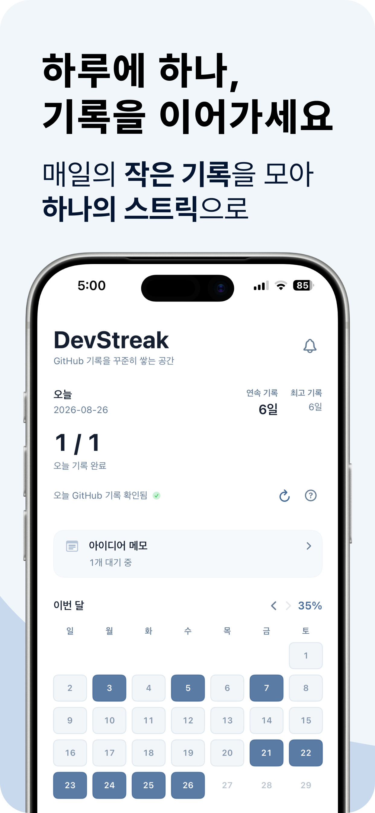
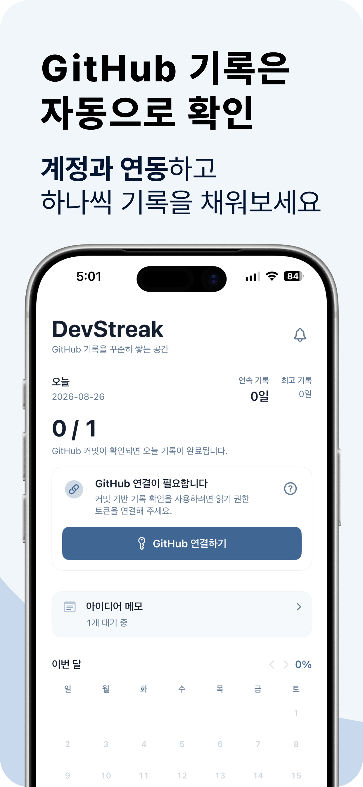
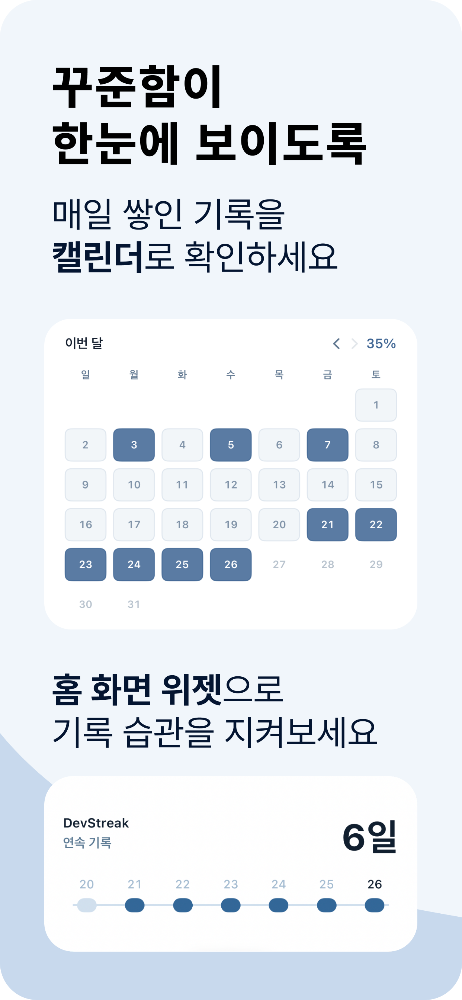
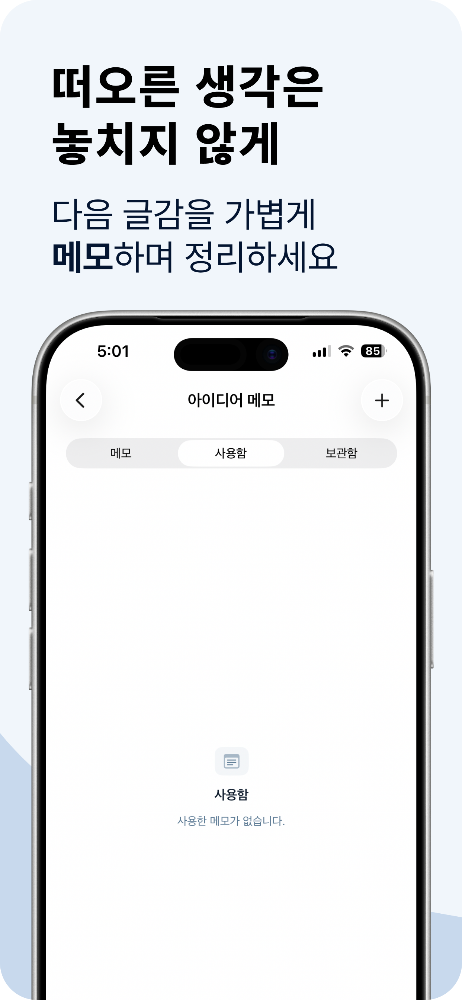

# DevStreak

GitHub 기록을 꾸준히 이어가고 싶은 사람을 위한 가벼운 iOS 앱입니다.

DevStreak는 매일 하나의 기록을 남기는 습관을 눈에 보이게 만들고, GitHub 커밋 기록을 바탕으로 오늘의 기록 여부와 연속 기록을 확인할 수 있게 도와줍니다.

현재 버전은 하나의 저장소를 기준으로 기록을 확인합니다.

## Screenshots

| 하루 기록 | GitHub 연결 | 캘린더와 위젯 | 아이디어 메모 |
| --- | --- | --- | --- |
|  |  |  |  |

## What It Does

- 오늘 기록 상태를 `0 / 1` 또는 `1 / 1`로 표시합니다.
- GitHub 커밋 기록을 확인해 오늘의 기록 여부를 자동으로 반영합니다.
- 현재 연속 기록과 최고 기록을 보여줍니다.
- 월간 캘린더로 기록 흐름을 확인할 수 있습니다.
- 아이디어 메모를 저장하고 `사용함`, `보관함`으로 정리할 수 있습니다.
- 기록 리마인더 알림을 설정할 수 있습니다.
- 홈 화면 및 잠금 화면 위젯을 지원합니다.

## Why

꾸준히 기록하고 싶어도, 매일의 작은 기록은 쉽게 흩어집니다.

DevStreak는 GitHub 잔디처럼 눈에 보이는 흐름을 앱 안으로 가져와 “오늘 했는지”, “며칠째 이어지고 있는지”, “이번 달은 어떤 흐름인지”를 빠르게 확인하도록 만든 도구입니다.

글을 대신 써주거나 저장소를 수정하는 앱이 아니라, 기록 습관을 놓치지 않게 돕는 companion app에 가깝습니다.

## How It Works

1. 사용자가 GitHub fine-grained personal access token을 앱에 저장합니다.
2. DevStreak가 지정된 저장소의 커밋 기록을 read-only로 확인합니다.
3. 인정된 콘텐츠 경로에 변경이 있으면 해당 날짜를 완료 기록으로 반영합니다.
4. 대시보드, 캘린더, 위젯, 알림이 같은 기록 상태를 기준으로 갱신됩니다.

대상 저장소:

```text
sssuunnnm/dev-archive
```

현재 MVP는 `main` branch와 open Pull Request commit을 기준으로 확인합니다. 다중 저장소 선택과 branch/ref 선택은 후속 범위입니다.

## Main Features

### Dashboard

대시보드는 앱의 첫 화면입니다.

- 오늘 날짜와 목표 상태
- 현재 연속 기록
- 최고 기록
- GitHub 기록 확인 상태
- 아이디어 메모 대기 개수
- 월간 캘린더와 달성률

오늘이 아직 미완료인 상태만으로 streak를 바로 끊지 않습니다. 오늘 기록이 없더라도 어제까지 이어진 streak는 유지됩니다.

### Calendar

캘린더는 날짜를 다음 상태로 표시합니다.

- `completed`: GitHub 기록이 확인된 날짜
- `missed`: 이미 지난 날짜인데 기록이 없는 날짜
- `pending`: 오늘이며 아직 기록이 없는 날짜
- `future`: 오늘보다 미래 날짜
- `untracked`: GitHub 연결 전이거나 저장소 생성일 이전 날짜

월간 달성률은 실제로 추적 가능한 날짜만 기준으로 계산합니다.

### GitHub Verification

GitHub 연동은 기록 확인만 수행합니다.

- GitHub API read-only request만 사용
- GitHub write operation 없음
- Pull Request 생성/수정 없음
- GitHub Actions 실행 없음
- token은 Keychain에만 저장
- token이 저장되어 있으면 입력칸을 숨기고 연결 테스트와 삭제만 제공

GitHub token을 삭제하면 GitHub로 확인된 로컬 기록과 저장소 메타데이터를 초기화하고, 캘린더는 다시 중립 상태로 돌아갑니다.

### Idea Memo

떠오른 생각을 가볍게 적어두는 메모 공간입니다.

- 메모 생성, 수정, 삭제
- 사용함 처리
- 보관 및 보관 해제
- 태그 저장
- Claude로 넘길 글쓰기 prompt 생성 및 clipboard 복사

DevStreak는 Claude API를 직접 호출하지 않습니다. prompt를 생성해 clipboard에 복사하고, 사용자가 직접 이어서 사용할 수 있게 돕습니다.

### Reminder

기록을 놓치지 않도록 로컬 알림을 예약합니다.

기본 리마인더:

- 아침 09:00
- 저녁 18:00
- 밤 22:00

알림 권한이 허용된 뒤에만 리마인더 설정을 변경할 수 있습니다. 변경한 시간과 토글은 사용자가 적용했을 때 저장됩니다.

### Widgets

WidgetKit 기반 홈 화면 및 잠금 화면 위젯을 제공합니다.

지원 family:

- `systemSmall`
- `systemMedium`
- `accessoryCircular`
- `accessoryRectangular`
- `accessoryInline`

홈 화면 위젯은 연속 기록과 최근 기록 흐름을 보여주고, 잠금 화면 위젯은 연속 기록 또는 오늘 기록 여부를 빠르게 확인할 수 있게 합니다.

## Privacy

DevStreak는 local-first app입니다.

개발자는 사용자의 기록, 메모, 알림 설정, GitHub token을 수집하거나 서버로 전송하지 않습니다.

- DailyRecord와 Idea는 기기 내 SwiftData에 저장됩니다.
- Reminder 설정은 기기 내 UserDefaults에 저장됩니다.
- Widget 공유 상태는 App Group UserDefaults에 최소 snapshot만 저장됩니다.
- GitHub token은 Keychain에만 저장됩니다.
- GitHub token은 GitHub API 요청의 Authorization header에만 사용됩니다.
- Analytics SDK, tracking SDK, backend server를 사용하지 않습니다.

Privacy Policy:

- [DevStreak Privacy Policy](https://sssuunnnm.notion.site/DevStreak-Privacy-Policy-3c70f65e84d680c0a1e0e02425ccc7d2)

Contact:

- `sssuunnnm@gmail.com`

## Tech Stack

- SwiftUI
- SwiftData
- WidgetKit
- UserNotifications
- Security / Keychain
- App Groups
- Swift Testing
- XCTest UI Tests

## Project Structure

```text
DevStreak/
├── DevStreak/
│   ├── DevStreakApp.swift
│   ├── Models/
│   ├── Features/
│   │   ├── Dashboard/
│   │   ├── Ideas/
│   │   └── Settings/
│   ├── Services/
│   ├── Shared/
│   └── Design/
├── DevStreakWidget/
├── DevStreakTests/
└── DevStreakUITests/
```

## Architecture Notes

DevStreak는 SwiftUI와 SwiftData를 중심으로 구성되어 있습니다.

복잡한 계산과 side effect는 작은 service로 분리하고, 화면은 표시 상태와 사용자 action에 집중하도록 정리하고 있습니다.

자세한 구현 메모와 hand-off 정보는 [technical-notes.md](docs/technical-notes.md)에 정리되어 있습니다.

주요 service:

- `DateService`: 날짜, timezone, dateKey 처리
- `StreakService`: 현재/최고 streak 계산
- `HabitCalendarService`: 캘린더 상태와 월간 달성률 계산
- `GitHubVerificationService`: GitHub 기록 확인
- `GitHubDailyRecordUpdater`: 검증 결과를 DailyRecord에 반영
- `ReminderNotificationService`: 14일 rolling local notification 예약
- `WidgetSnapshotService`: 앱 상태를 위젯 snapshot으로 변환

## Data Flow

### GitHub Verification

```text
Dashboard refresh
→ GitHubVerificationService.verify()
→ GitHub REST API read-only requests
→ content path matching
→ GitHubDailyRecordUpdater
→ DailyRecord githubVerified 생성/승격
→ ModelContext.save()
→ WidgetSnapshot refresh
→ 오늘 verified인 경우 오늘 reminder cancel
```

### Widget

```text
App SwiftData state
→ WidgetSnapshotService.makeSnapshot()
→ App Group UserDefaults
→ WidgetSnapshotStore.load()
→ WidgetDisplayState
→ WidgetKit timeline
```

## Requirements

- Xcode with iOS 26.5 SDK
- iOS deployment target: 17.0
- App Group: `group.com.sssuunnnm.DevStreakApp`

Targets:

- `DevStreak`
- `DevStreakWidget`
- `DevStreakTests`
- `DevStreakUITests`

Bundle identifiers:

- App: `com.sssuunnnm.DevStreakApp`
- Widget: `com.sssuunnnm.DevStreakApp.DevStreakWidget`

## Build & Test

Open the project:

```bash
open DevStreak/DevStreak.xcodeproj
```

Build app:

```bash
xcodebuild \
  -project DevStreak/DevStreak.xcodeproj \
  -scheme DevStreak \
  -destination 'generic/platform=iOS Simulator' \
  CODE_SIGNING_ALLOWED=NO \
  build
```

Run tests:

```bash
xcodebuild \
  -project DevStreak/DevStreak.xcodeproj \
  -scheme DevStreak \
  -destination 'platform=iOS Simulator,name=iPhone 15 Pro,OS=17.0.1' \
  CODE_SIGNING_ALLOWED=NO \
  -only-testing:DevStreakTests \
  test
```

## App Store Assets

App Store / TestFlight 제출용 metadata와 preview image 초안은 repo 안에 보관합니다.

- [metadata-ko.md](docs/app-store/metadata-ko.md): App Store Connect 한국어 메타데이터
- [Preview-1.png](docs/app-store/previews/Preview-1.png): 하루 기록과 dashboard
- [Preview-2.png](docs/app-store/previews/Preview-2.png): GitHub 연결 필요 상태
- [Preview-3.png](docs/app-store/previews/Preview-3.png): calendar와 home screen widget
- [Preview-4.png](docs/app-store/previews/Preview-4.png): Idea memo 화면

## Current Release

- Version: `1.0`
- Deployment target: iOS 17.0
- Language: Korean
- Availability: South Korea
- Price: Free
- App Store review submitted: 2026-08-26

## Known Follow-ups

배포 전 차단 이슈는 아니지만, 후속 안정화 작업으로 추적합니다.

- Initial backfill resume: 최근 3년 초기 동기화가 API request budget을 초과하면 다음 시도도 처음부터 다시 시작합니다. pagination 진행 위치 저장 또는 기간 단위 분할 저장이 필요합니다.
- Dashboard GitHub verification coordinator: Dashboard의 자동 verification 상태 전이와 side effect 일부가 아직 `DashboardView`에 남아 있습니다. Settings 쪽처럼 coordinator/view model로 분리하면 테스트와 유지보수가 쉬워집니다.
- GitHub branch selection: 현재 MVP는 `main` branch와 open PR commit만 확인합니다. 사용자가 branch/ref를 선택하는 UI는 후속 범위입니다.
- Repository scope expansion: 현재 MVP는 `sssuunnnm/dev-archive` 단일 repository만 지원합니다. 다중 repository 선택은 후속 범위입니다.
